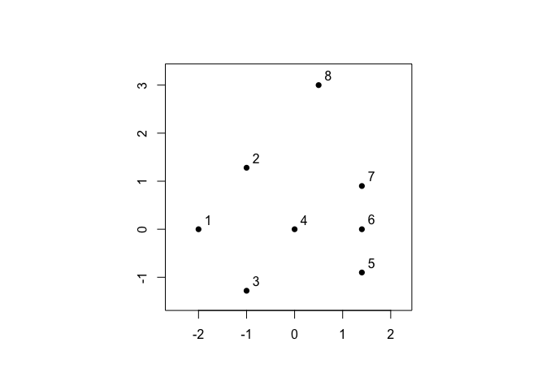
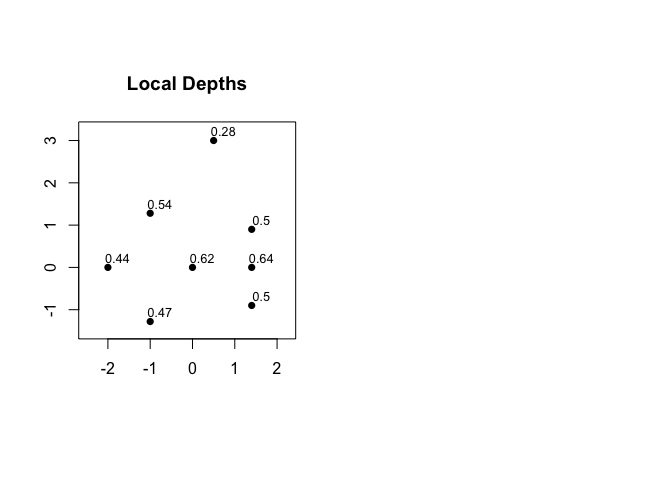
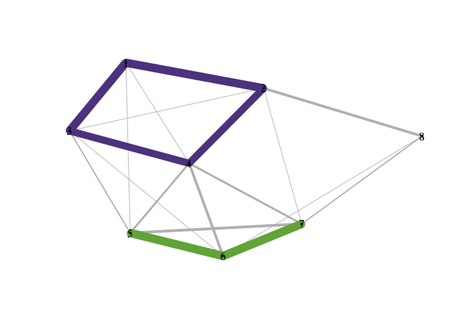
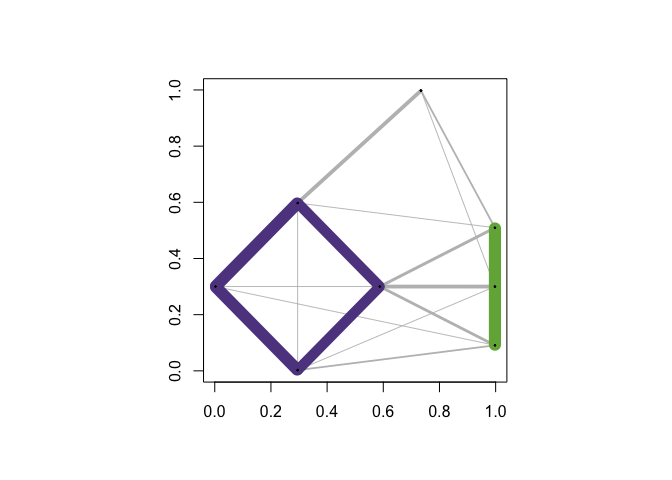
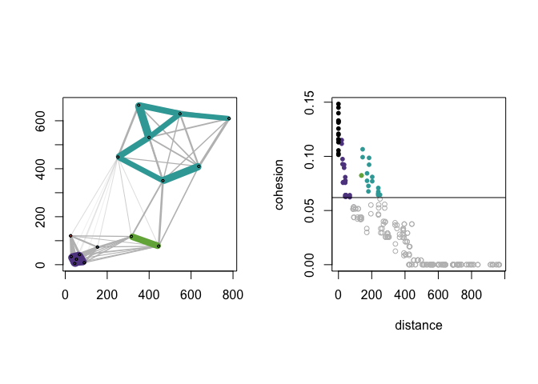
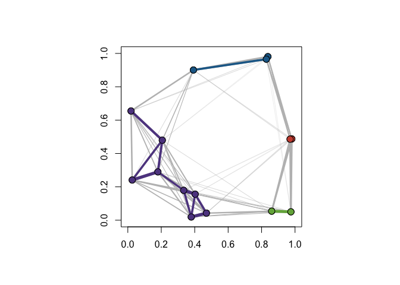
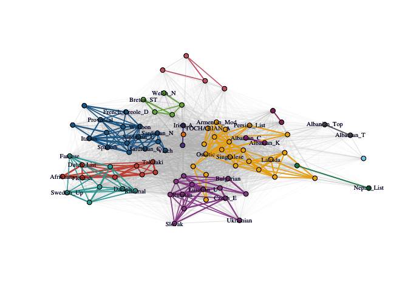

Partitioned Local Depth
================
Katherine Moore, Kenneth Berenhaut, and Lucy D’Agostino McGowan
January 2022

<!-- README.md is generated from README.Rmd. Please edit that file -->
<!-- badges: start -->

[](https://github.com/LucyMcGowan/pald/actions/workflows/check-standard.yaml)
<!-- badges: end -->

This package provides an implementation of the Partitioned Local Depth
(PaLD) approach which consists of a measure of *local depth* and the
*cohesion* of a point to another which, together with a universal
threshold for distinguishing strong and weak ties, may be used to reveal
local and global structure in data. No extraneous inputs, distributional
assumptions, iterative procedures nor optimization criteria are
employed. This package includes functions for computing local depths and
cohesion matrices as well as flexible functions for plotting community
networks and displays of cohesion against distance.

For further discussion of the perspective, including some theoretical
results and applications, see:

Berenhaut, Kenneth S., Katherine E. Moore, and Ryan L. Melvin. 2022. “A
Social Perspective on Perceived Distances Reveals Deep Community
Structure.” *Proceedings of the National Academy of Sciences,* 119 (3).

## Installation

Install the CRAN version:

``` r
install.packages("pald")
```

Or you can install the development version of pald from GitHub with:

``` r
# install.packages("devtools")
devtools::install_github("LucyMcGowan/pald")
```

``` r
library(pald)
```

## Input

The input for the Partitioned Local Depth (PaLD) approach is a distance
matrix (or `dist` object) associated with a finite collection of data
points. Throughout, no distributional assumptions, iterative procedures
nor optimization criteria are employed.

The only information extracted from the distance matrix are
within-triplet dissimilarity comparisons. As a result, outputs are
unaffected by monotone transformations of the collection of distances
(e.g., $\log_2$). Further, one may transform any measure of similarity,
$s(x, y)$, to a measure of dissimilarity, $d(x,y)$, via any
order-reversing monotone transformation, for instance by taking
$d(x, y) = 1/(1 + s(x, y))$. This provides the user some flexibility in
the choice of dissimilarity (e.g., triangle inequality is not required)
and care should be taken at this stage.

The function `dist()` from the `stats` package converts an input data
frame (with $n$ rows) into an $n \times n$ distance matrix. In Euclidean
examples here, we will use the default Euclidean distance.

## A Small Example

For demonstration purposes, let’s begin with the small example from
Figure 1 in (Berenhaut, Moore, and Melvin 2022).  


The wrapper function `pald()` computes the cohesion matrix from which
local depths are determined and community networks may be formed. In the
plots of the community networks, strongly cohesive pairs are colored
according to connected component. Such connected components may be
considered “(community) clusters.” Note that the Fruchterman Reingold
(FR) force-directed network drawing algorithm employed here will provide
somewhat different graph layouts each time it is run.

``` r
par(mfrow = c(1, 2), pty = "s")  

D <- dist(exdata1)
pald_results <- pald(D, emph_strong = 1, vertex.label.cex = 3)
```


``` r

###

plot(exdata1,
     pch = 16,
     xlim = c(-2.5, 2.25),
     ylim=c(-1.5, 3.25),
     xlab = "", 
     ylab = "",  
     main = "Local Depths")
text(exdata1 + .23, 
     lab = round(pald_results$local_depths, 2), 
     xlim = c(-2.5, 2.25),
     ylim = c(-1.5, 3.25), 
     xlab = "", 
     ylab = "", 
     cex = .8)
```



The wrapper function `pald()` returns a list containing: the cohesion
matrix, local depths, (community) clusters, the threshold for
identifying strong ties, the thresholded and symmetrized cohesion
matrix, the community graph whose edges are weighted by mutual cohesion,
the weighted graph of strong ties, and the layout provided by the FR
network drawing algorithm applied to the community graph.

Each time the function `pald()` is called, the matrix of cohesion values
is re-computed. To avoid unnecessary computation, the following
functions are included: `local_depths()`,`strong_threshold()`,
`cohesion_strong()`, `community_graphs()`, and
`plot_community_graphs()`. We will now walk through each function in
turn.

## Cohesion Matrix

Cohesion reflects relationship strength from the perspective of relative
position, see (Berenhaut, Moore, and Melvin 2022). To begin PaLD
analysis, we must first compute the matrix of cohesion values from the
input distance matrix or `dist` object. Note that cohesion is not
symmetric. The values, $C[x, w]$, in the cohesion matrix are
interpretable probabilities which capture the strength of the alignment
of $w$ to $x$. The sum of the cohesion matrix is always equal to $n/2$
(where $n$ is the number of data points).

``` r
D <- dist(exdata1)
C <- cohesion_matrix(D)
round(C, 4)
#>        1      2      3      4      5      6      7      8
#> 1 0.1658 0.1199 0.1199 0.0179 0.0179 0.0000 0.0000 0.0000
#> 2 0.1306 0.1765 0.0179 0.1199 0.0000 0.0000 0.0204 0.0765
#> 3 0.1187 0.0204 0.1646 0.1054 0.0383 0.0179 0.0000 0.0000
#> 4 0.0179 0.1043 0.1043 0.1787 0.0621 0.0954 0.0621 0.0000
#> 5 0.0179 0.0000 0.0357 0.0561 0.1871 0.1216 0.0799 0.0000
#> 6 0.0000 0.0000 0.0204 0.0765 0.1599 0.2075 0.1599 0.0179
#> 7 0.0000 0.0179 0.0000 0.0595 0.0799 0.1216 0.1871 0.0357
#> 8 0.0000 0.0799 0.0000 0.0000 0.0000 0.0179 0.0357 0.1514
#> attr(,"class")
#> [1] "cohesion_matrix" "matrix"          "array"

# A heat-map of the cohesion matrix
image(t(apply(C, 2, rev)), main = "Cohesion Matrix Heatmap")
```


## Local Depths

Local depth is a probability which describes the support for each point
in data-determined local foci. Cohesion is obtained by partitioning
local depth, and thus the values of local depth can be computed as the
row sums of the cohesion matrix. See also Figure 2(b), above. The
average of the values of local depth is always equal to 1/2.

``` r
# local depths are obtained by computing: rowSums(C)
local_depths(C)
#>         1         2         3         4         5         6         7         8 
#> 0.4413265 0.5418367 0.4653061 0.6246599 0.4982993 0.6420068 0.5017007 0.2848639
mean(local_depths(C))
#> [1] 0.5
```

## Threshold and Strong Ties

The threshold provided in (Berenhaut, Moore, and Melvin 2022) for
distinguishing between strongly and weakly cohesive pairs is equal to of
half the average of the diagonal of the cohesion matrix. A function for
computing this is provided.

``` r
# the threshold is obtained by computing: mean(diag(C))/2
strong_threshold(C)
#> [1] 0.08866922
```

Pairs of points for which mutual cohesion (i.e.,
$\min\{C_{x, w}, C_{w, x}$}) is greater than the above threshold are
considered to be \`\`strongly cohesive.” The thresholded and symmetrized
cohesion matrix can be obtained using the function ‘cohesion_strong.’

``` r
round(cohesion_strong(C), 4)
#>        1      2      3      4      5      6      7      8
#> 1 0.1658 0.1199 0.1187 0.0000 0.0000 0.0000 0.0000 0.0000
#> 2 0.1199 0.1765 0.0000 0.1043 0.0000 0.0000 0.0000 0.0000
#> 3 0.1187 0.0000 0.1646 0.1043 0.0000 0.0000 0.0000 0.0000
#> 4 0.0000 0.1043 0.1043 0.1787 0.0000 0.0000 0.0000 0.0000
#> 5 0.0000 0.0000 0.0000 0.0000 0.1871 0.1216 0.0000 0.0000
#> 6 0.0000 0.0000 0.0000 0.0000 0.1216 0.2075 0.1216 0.0000
#> 7 0.0000 0.0000 0.0000 0.0000 0.0000 0.1216 0.1871 0.0000
#> 8 0.0000 0.0000 0.0000 0.0000 0.0000 0.0000 0.0000 0.1514
#> attr(,"class")
#> [1] "cohesion_matrix" "matrix"          "array"
```

## Community Structure and Display

The overall structure of the data can be observed via the networks
obtained from cohesion (referred to here as “community graphs”). The
community graph is a symmetric, weighted graph which is obtained from
symmetrizing the cohesion matrix (using $\min\{C_{x, w}, C_{w, x}\}$)
and removing self-loops. The “community cluster graph” is the subgraph
consisting of only the edges for which mutual cohesion greater than the
above threshold.

The connected components of the community cluster graph, `G_strong`, are
referred to the (community) clusters of the data. Note that no
additional inputs (e.g., number of clusters, neighborhood size) nor
optimization criteria are employed in (community) cluster
identification.

Strong ties between points will not be severed; if further partitioning
of the community graph is desired, one could employ other methods (for
instance, the Louvain method) to the resulting community graphs.

``` r
graphs <- community_graphs(C)

community_clusters(C)
#>   point cluster
#> 1     1       1
#> 2     2       1
#> 3     3       1
#> 4     4       1
#> 5     5       2
#> 6     6       2
#> 7     7       2
#> 8     8       3
```

A function for plotting the community graphs, in which the edges and
vertices are colored according to cluster membership, is provided. The
default layout is obtained via the Fruchterman Reingold (FR)
force-directed graph drawing algorithm. Note that the FR force-directed
algorithm will provide somewhat different layouts each time it is run.

``` r
plot_community_graphs(C) 
```



You can save a particular network layout using
`community_graphs(C)$layout`.The function `plot_community_graphs` can
take a given layout as an argument. Below, let’s overlay the community
graph on the original data, that is, plot the network using the layout
provided by the original data.

``` r
par(pty = "s")
plot(exdata1,
     xlim = c(0, 1), 
     ylim = c(0, 1), 
     col = "white",
     xlab = "", 
     ylab = "")
par(new = TRUE)
plot_community_graphs(C, layout = as.matrix(exdata1), show_labels = FALSE)
```



## Cohesion Against Distance

Observe that cohesion is not a direct transformation of distance. The
`dist_cohesion_plot()` function provides a plot of pairwise distances
and associated value(s) of cohesion; the horizontal line indicates the
threshold. Within-cluster edges are colored, and weak ties are plotted
as open circles. See (Berenhaut, Moore, and Melvin 2022) for more on the
interpretation of these plots.

Let’s re-create Figure 2 in (Berenhaut, Moore, and Melvin 2022).

``` r
D <- dist(exdata2)
C <- cohesion_matrix(D)
par(mfrow = c(1, 2))
par(pty = "s")
plot(exdata2,
     col = "white",
     xlab = "",
     ylab = "")
par(new = TRUE)
plot_community_graphs(C,
                      layout = as.matrix(exdata2),
                      show_labels = FALSE,
                      vertex.size = 3)
dist_cohesion_plot(D, cex = .8, weak_gray = TRUE)
```



Rather than showing both pairs, (d(x, y), C(x, w)) and (d(x, y), C(w,
x)) as distinct points in the plot, setting `mutual = TRUE` will only
plot mutual cohesion, that is the set of points with x-coordinate d(x,
y) and y-coordinate min{C(x, w), C(w, x)}.

``` r
par(pty = "s")
D <- dist(exdata2)
dist_cohesion_plot(D, mutual = TRUE)
```


## Randomly-Generated Data

In this example, we consider a randomly-generated data set of 15 points.
Points are selected according to the uniform distribution on the unit
square. We first compute the distance matrix and from this calculate the
cohesion matrix. We overlay the community graphs on the data set using
`plot_community_graphs` and use our original data as the `layout`.

``` r
ex_data <- matrix(runif(30), ncol = 2)
D <- dist(ex_data)
C <- cohesion_matrix(D)
par(pty = "s")
plot(
  ex_data,
  xlim = c(0, 1),
  ylim = c(0, 1),
  col = "white",
  xlab = "",
  ylab = ""
)
par(new = TRUE)
plot_community_graphs(
  C,
  layout = ex_data,
  emph_strong = 1,
  show_labels = FALSE,
  edge_width_factor = 50,
  vertex.size = 8
)
```



## Cognate-based Language Families

Let’s perform PaLD analysis on the cognate data set from (Dyen, Kruskal,
and Black 1992). For clarity of the display, we show how to only include
(a random set of the) 37 vertex labels. The remaining arguments are for
aesthetics of the plot. Note that the network layout is somewhat
different each time the FR network drawing algorithm is called.

``` r
C_lang <- cohesion_matrix(cognate_dist)
lang_lab_subset <- rownames(C_lang)
lang_lab_subset[sample(1:87, 50)] <- ''
plot_community_graphs(
  C_lang,
  edge_width_factor = 30,
  emph_strong = 3,
  vertex.label = lang_lab_subset,
  vertex.label.cex = .65,
  vertex.size = 3
)
```



One could alternatively use the wrapper function:
$\texttt{pald(cognate_dist, emph_strong = 3, edge_width_factor = 30, vertex.label = lang_lab_subset, vertex.label.cex = .65, vertex.size = 3)}$.
It will return a list containing: the cohesion matrix, local depths,
(community) clusters, the threshold for identifying strong ties, the
thresholded and symmetrized cohesion matrix, the community graph whose
edges are weighted by mutual cohesion, the weighted graph of strong
ties, and the layout provided by the FR network drawing algorithm
applied to the community graph.

One can determine the (strongly cohesive) neighbors using igraph’s
`neighbor` function. Edge-weights are given by cohesion (or mutual
cohesion) and can be found directly from the cohesion matrix.

``` r
library(igraph)
G_strong_lang <- community_graphs(C_lang)$G_strong
neighbors(G_strong_lang, "French")
#> + 8/87 vertices, named, from 8cc26e0:
#> [1] Italian         Ladin           Provencal       Walloon        
#> [5] French_Creole_C French_Creole_D Spanish         Catalan

#And print associated neighborhood weights
C_lang["French", neighbors(G_strong_lang, "French")]
#>         Italian           Ladin       Provencal         Walloon French_Creole_C 
#>      0.01997696      0.02094596      0.02871174      0.03258771      0.02406057 
#> French_Creole_D         Spanish         Catalan 
#>      0.02406057      0.01679733      0.01859688
```

## Clustering in the Presence of Varying Density

Cohesion is particularly useful when considering data with varying local
density, see discussion in (Berenhaut, Moore, and Melvin 2022). Note
that PaLD was able to detect the eight natural groups within the data
without the use of any additional inputs (e.g., number of clusters) nor
optimization criteria. Despite providing the “correct” number of
clusters (i.e., $k = 8$) both *k*-means and hierarchical clustering did
not give the desired result.

``` r
D3 <- dist(exdata3)
C3 <- cohesion_matrix(D3)
par(pty = "s")
plot(
  exdata3,
  col = "white",
  xlab = "",
  ylab = "",
  main = "PaLD Community Graphs"
)
par(new = TRUE)
plot_community_graphs(
  C3,
  layout = as.matrix(exdata3),
  show_labels = FALSE,
  emph_strong = 25,
  edge_width_factor = 2,
  vertex.size = 5
)
### The cluster vector is provided by `pald' and also may be computed via:
library(igraph)
cluster_graph <- community_graphs(C3)$G_strong
#pald_cluster_vector<- clusters(cluster_graph)$membership
table(clusters(cluster_graph)$membership)
#> 
#>  1  2  3  4  5  6  7  8 
#> 40 40 60 20 20 20 20 20
```


Here are the results for the data obtained from *k*-means and
hierarchical clustering when $k = 8$.

``` r
par(mfrow = c(1, 2), pty = "s")
km_clusters <- kmeans(exdata3, 8)$cluster
plot(
  exdata3,
  pch = 16,
  col = pald_colors[km_clusters],
  xlab = "",
  ylab = "",
  main = "K-Means Clusters (k = 8)"
)
h_clusters <- cutree(hclust(dist(exdata3)), k = 8)
plot(
  exdata3,
  pch = 16,
  col = pald_colors[h_clusters],
  xlab = "",
  ylab = "",
  main = "Hiearchical Clusters (k = 8)"
)
```


<div id="refs" class="references csl-bib-body hanging-indent">

<div id="ref-bmm22" class="csl-entry">

Berenhaut, Kenneth S., Katherine E. Moore, and Ryan L. Melvin. 2022. “A
Social Perspective on Perceived Distances Reveals Deep Community
Structure.” *Proceedings of the National Academy of Sciences* 119 (3).

</div>

<div id="ref-dyen92" class="csl-entry">

Dyen, Isidore, Joseph B. Kruskal, and Paul Black. 1992. “An Indoeuropean
Classification: A Lexicostatistical Experiment.” *Transactions of the
American Philosophical Society* 82 (5): iii.

</div>

</div>
